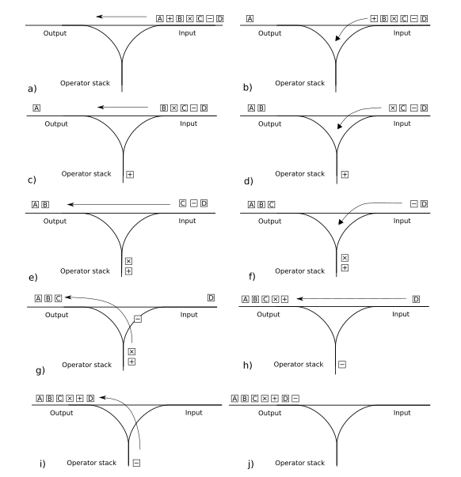

# Laboratorio 2

## 📁 Estructura del repositorio

```
lab2/
├── config               # Carpeta de funciones para cada ejercicio
   └── exercise2.go      # Funciones de stack para ejercicio 2
   └── exercise3.go      # Funciones de infix y postfix para ejercicio 3
├── exercise2.go         # Verificador de expresiones balanceadas
├── expressions2.txt     # Expresiones de prueba para el ejercicio 2
├── exercise3.go         # Shunting Yard: infix → postfix
├── expressions3.txt     # Expresiones de prueba para el ejercicio 3
└── README.md            # Este archivo
```

---

## ⚙️ Requisitos previos

- **Go** (versión 1.18 o superior) instalado en tu máquina.
- **Git** instalado (para clonar o versionar).
- Línea de comandos (Terminal, PowerShell, etc.).

---

## 🛠️ Instalación

1. **Clona** tu repositorio (si aún no lo has hecho):
   ```bash
   https://github.com/AscencioSIUU/TeoriaComputacion.git
   cd labs/lab2
   ```
2. Asegúrate de tener Go en tu PATH:
   ```bash
   go version
   ```
   Debe mostrar algo como `go version go1.24.1 darwin/arm64`.

---

## ▶️ Ejecución

### 🔹 Ejercicio 2 — Verificador de expresiones balanceadas

1. Coloca tus expresiones en `expressions2.txt`, una por línea.
2. Para **ejecutar directamente** sin compilar:
   ```bash
   go run exercise2.go
   ```
3. Para **compilar** y luego ejecutar:
   ```bash
   go build -o verifier exercise2.go
   ./verifier
   ```

El programa leerá `expressions2.txt`, mostrará paso a paso las operaciones de pila y el resultado de cada línea.

---

### 🔹 Ejercicio 3 — Shunting Yard (infix → postfix)

1. Coloca tus expresiones en `expressions3.txt`, una por línea.
2. Para **ejecutar directamente**:
   ```bash
   go run exercise3.go
   ```
3. Para **compilar** y luego ejecutar:
   ```bash
   go build -o shunting exercise3.go
   ./shunting
   ```

El programa leerá `expressions3.txt`, mostrará los pasos del algoritmo y la conversión a notación postfix.

---

## 📄 Archivos de entrada

- **expressions2.txt**
  Contiene ejemplos como:
  ```
  a(a|b)*b+a?
  A(a|b)bB*[az]b]
  (a*b*c*d*(a|e|i|o|u))e*f*g*h){1,2}
  ^[aZ].com{5,30}
  ([[az][AZ]](((((.|;)|;)|.)|.)){10,20})*)
  ```
- **expressions3.txt**
  Infix de expresiones regulares (mismas del ejercicio 1), p. ej.:
  ```
  (a|b)c
  (a|b)*abb(a|b)*
  (a*|b*)*
  0?(1?)?0*
  …etc.
  ```

---

## 🔍 Investigación

1. **Algoritmo de Shunting Yard**

El algoritmo de shunting yard (patio de clasificación) fue nombrado así por Edsger Dijistra porque su operación se asemeja al patio de flasificación del ferrocarril. Este algoritmo es un metodo para analizar (parsing) las ecuaciones matemátias en notación infijo, volviendolas a notación postfijo. Esto lo ahce para que una computadora pueda entenderla y resolverla fácilmente.
El algoritmo lo resuelve utilizando una "pila" donde guarda temporalmente los operandos y luego las organiza en orden diferente, ya sea en estructura de árbol o en notacón polaca inversa "RPN"

La RPN es una notación de postfijo, fue introducida el 1920 por el matemático polaco Jan Łukasiewicz donde indica que cada operador esá antes de sus operandos. En dicha notación primero estpan los operandos y despues viene el operador que va a realizar los cálcuilos sobre ellos.

Pasos:

1. **Leer el siguiente token** de la expresión infix. `de izquierda a derecha`.
2. **Si es un operando** (letra, dígito, literal…):
   - Añadirlo **directamente** al final de la **cola de salida**.
3. **Si es un operador** (por ejemplo `+`, `*`, `?`, `|`):
   1. Mientras **la pila no esté vacía** y en su cima haya otro operador con **mayor o igual precedencia**:
      - Sacar ese operador de la pila y **añadirlo** a la cola de salida.
   2. **Apilar** el operador actual.
4. **Si es un paréntesis izquierdo** `(`, simplemente **apilarlo**.
5. **Si es un paréntesis derecho** `)`:
   1. Mientras la pila **no** tenga `(` en la cima:
      - Sacar operadores de la pila y **añadirlos** a la cola de salida.
   2. Sacar (pero **no** encolar) el `(` de la pila.
   3. (Opcional) Si justo encima del `(` había un **operador de función** o de unión implícita, sacarlo y **ponerlo** en la cola de salida.
6. **Fin de la lectura**:
   - Sacar **todos** los operadores que queden en la pila y **añadirlos** a la cola de salida.

Ejemplo del funcionamiento de la pila


2. **Ejemplo detallado**
   Entrada : 7 + 2 `*` 8 / ( 2 - 3 ) ^ 8 ^ 1

| Token | Acción                           | Salida en RPN               | Stack de operadores | Observacion                          |
| ----- | -------------------------------- | --------------------------- | ------------------- | ------------------------------------ |
| 7     | Se agrega token a la salida      | 3                           |                     |                                      |
| +     | Push del token al stack          | 3                           | +                   |                                      |
| 2     | Se agrega token a la salida      | 3 4                         | +                   |                                      |
| `*`   | Push del token al stack          | 3 4                         | `*` +               | \* tiene mayor presedencia que +     |
| 8     | Se agrega token a la salida      | 3 4 8                       | `*` +               |                                      |
| /     | Pop stack a la salida            | 3 4 8 `*`                   | +                   | / y \* tienen la misma presedencia   |
| /     | Push del token al stack          | 3 4 8 `*`                   | / +                 | / tiene mayor presedencia que +      |
| (     | Push del token al stack          | 3 4 8 `*`                   | ( / +               |                                      |
| 2     | Se agrega el token a la salida   | 3 4 8 `*` 2                 | ( / +               |                                      |
| -     | Push del token al stack          | 3 4 8 `*` 2                 | - ( / +             |                                      |
| 3     | Se agrega el token a la salida   | 3 4 8 `*` 2 3               | - ( / +             |                                      |
| )     | Pop stack a la salida            | 3 4 8 `*` 2 3 -             | ( / +               | Se repite hasta encontrar el "("     |
| )     | Pop stack                        | 3 4 8 `*` 2 3 -             | / +                 | Descarta el paréntesis emparejados   |
| ^     | Push token al stack              | 3 4 8 `*` 2 3 -             | ^ / +               | ^ tiene mayor presedencia que /      |
| 8     | Se agrega el token a la salida   | 3 4 8 `*` 2 3 - 8           | ^ / +               | ^ tiene mayor presedencia que /      |
| ^     | Push token al stack              | 3 4 8 `*` 2 3 - 8           | ^ ^ / +             | ^ es evaluado de derecha a izquierda |
| 1     | Agrega token a la salida         | 3 4 8 `*` 2 3 - 8 1         | ^ ^ / +             |                                      |
| end   | Pop a todo el stack de la salida | 3 4 8 `*` 2 3 - 8 1 ^ ^ / + |                     |                                      |

4. **Referencias bibliográficas**
colaboradores de Wikipedia. (2025, 22 febrero). Algoritmo shunting yard. Wikipedia, la Enciclopedia Libre. https://es.wikipedia.org/wiki/Algoritmo_shunting_yard

---
